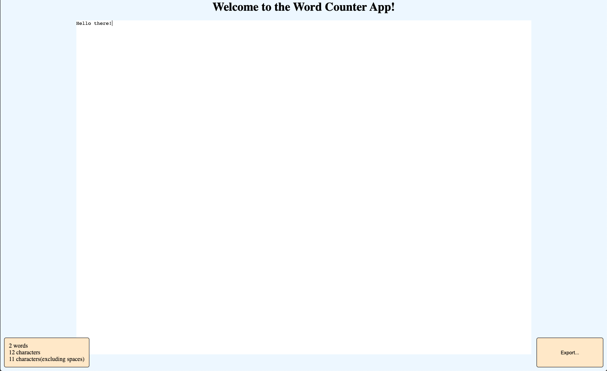

# CISC3140-Lab8   
## Practice Vanilla JavaScript.
---
### About
---
For Lab 8 I decided to work on a word counter program.   
This program has a minimalistic look, that is obtained using HTML and CSS. All the processing is done in word-counter.js file.
The main part of the program is a textarea HTML element that expects user input, on the bottom left there is a div holding few paragraphs with different information about the inputted text such as word count, characters count, and characters count excluding spaces, all of these stats are obtained using simple RegEx pattern matchers.   
Next important feature of this program is an export capability. When user inputs any character into textarea field, a button will show up in the bottom right corner of the screen allowing them to save the text they inputted with the stats regarding what's inputted into a .txt file. All this done using some simple JavaScript processing:   
    &nbsp;&nbsp;&nbsp;&nbsp;&nbsp;&nbsp;1. Input is sanitized to account for new lines in the output file.   
    &nbsp;&nbsp;&nbsp;&nbsp;&nbsp;&nbsp;2. Stats part is added to the text.   
    &nbsp;&nbsp;&nbsp;&nbsp;&nbsp;&nbsp;3. Blob of tye "text/plain" is created containing the sanitized input.   
    &nbsp;&nbsp;&nbsp;&nbsp;&nbsp;&nbsp;4. Anchor element with all the properties to export the text is created.   
    &nbsp;&nbsp;&nbsp;&nbsp;&nbsp;&nbsp;5. Anchor element is added to the DOM.   
    &nbsp;&nbsp;&nbsp;&nbsp;&nbsp;&nbsp;6. Anchor element is programmatically clicked.   
    &nbsp;&nbsp;&nbsp;&nbsp;&nbsp;&nbsp;7. Finally, anchor element is getting removed from DOM.

Note: All of the code for this assignment is stored under /app.   

### Setup and Usage
---
1. While you are in the home directory of this repo, press on the green "Code" button in the top right corner.
2. You will be prompted to copy an SSH or HTTPS URL to clone this repo to your local machine(I personally prefer to clone over SSH, because it's more secure).
3. After you got that URL, go to the terminal on your local machine and run the following command: 
```zsh
git clone *PASTE THE LINK HERE*
```
4. It should not tale long to copy all the files to your computer, since this is a very lightweight repo, so after it's done cd to the newly created folder by running: 
```zsh 
cd CISC3140-Lab8/app
```  
5. When you are inside of the app directory, run the following command: 
```zsh
open index.html
```
That's it, after that you will be presented with a simple word counter program.   

